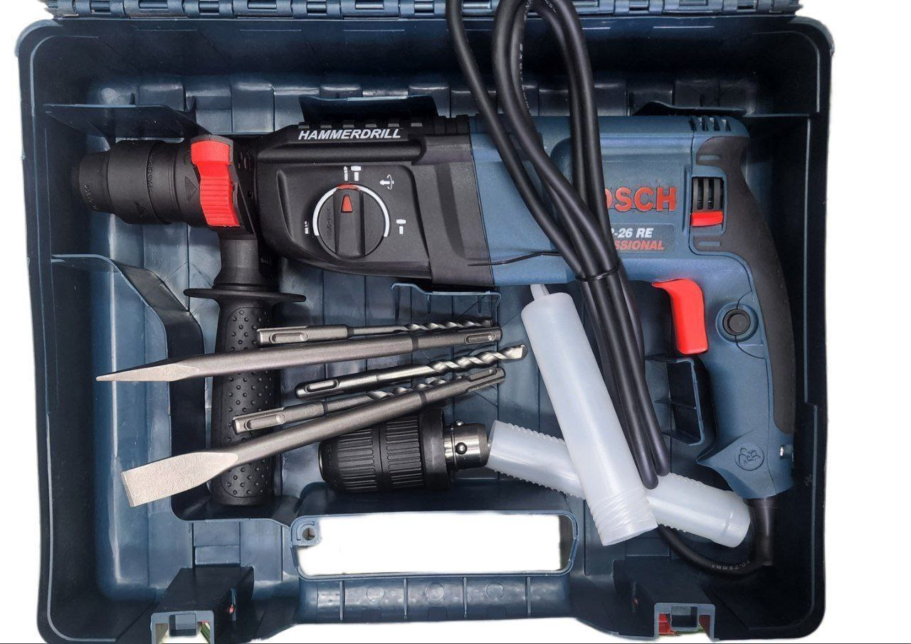

photo_2023-12-27_14-59-16.jpg
photo_2023-12-27_14-59-21.jpg
photo_2023-12-27_14-59-24.jpg
photo_2023-12-27_14-59-30.jpg
# ⚡️💪 Four tools for today

# 1. Hammer Drill Showdown: Makita vs. Bosch! 🔨🔧

Get ready to unleash the power of Thor's hammer in your DIY adventures with these electrifying hammer drills from the legendary houses of Makita and Bosch! ⚡️💪

## Features:

- **Power Input:** 800W (because we believe in overachieving!)
- **Chuck Type:** SDS-PLUS (because regular chucks are so last season)
- **Motor Type:** Brushed (no, we're not talking about your morning hair routine)
- **Max. Drilling Capacity (Concrete):** 24mm (15/16”), because who said concrete can't be charming?
- **Max. Drilling Capacity (Steel):** 13mm (1/2”), tackling steel like a superhero
- **Max. Drilling Capacity (Wood):** 32mm (1-1/4”), because we believe in equality for all materials
- **Impacts Per Minute:** 0-4,500bpm (that's beats per minute, not your favorite song)
- **No Load Speed:** 0-1,100rpm (making speed limits jealous)
- **Dimensions (LxWxH):** 370x84x214mm (14-1/4"x3-5/16"x8-3/8"), because size matters in the tool world!
- **Net Weight:** 2.9kg (lighter than a bag of feathers, but much more useful)
- **Power Supply Cord:** 2.5m (because short cords are just... short)

## Pricing:

- **Makita:** Makita - 8000birr, because quality comes with a price
- **Bosch:**  Bosch - 7700birr, because Bosch believes in affordability

**ያሉበት በነጻ እናደርሳለን!**
📞 **Call us +2519549387!**
- **Inbox: @davedave77 ** telegram.

Get ready to drill, baby, drill! 🔩💥
