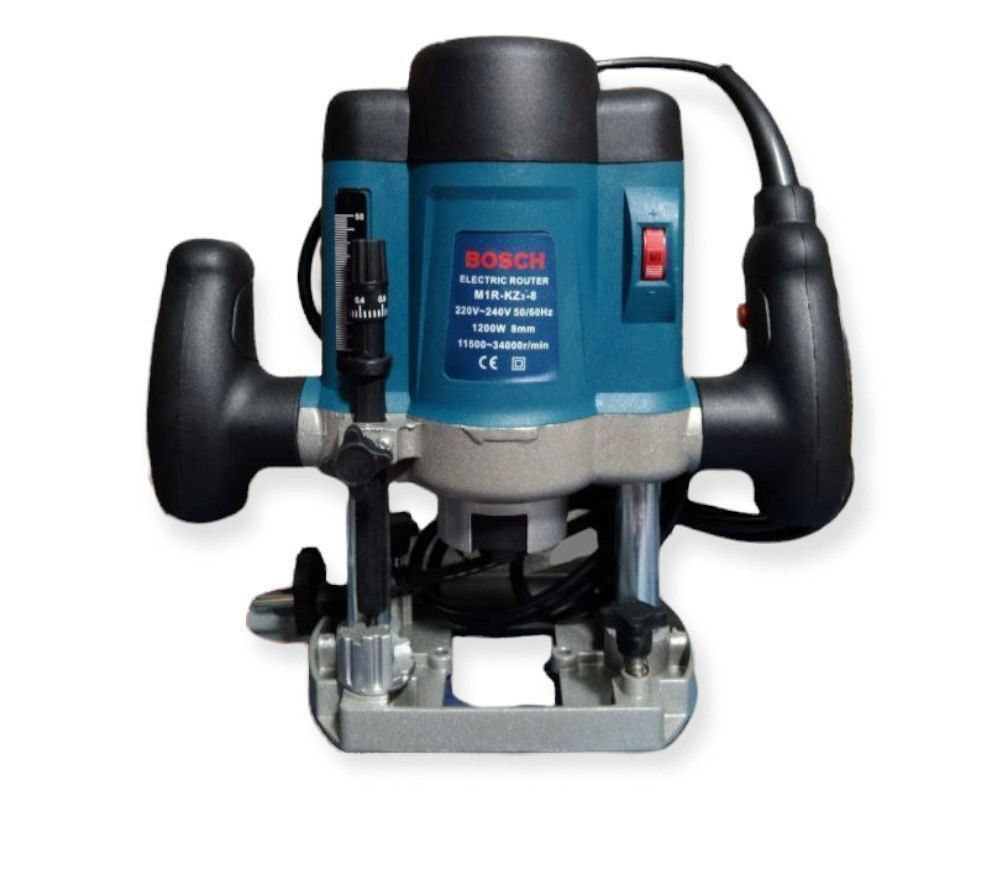

photo_2023-12-27_14-59-16.jpg
photo_2023-12-27_14-59-21.jpg
photo_2023-12-27_14-59-24.jpg
photo_2023-12-27_14-59-30.jpg
# ⚡️💪 Four tools for today

# 1. Hammer Drill Showdown: Makita vs. Bosch! 🔨🔧

Get ready to unleash the power of Thor's hammer in your DIY adventures with these electrifying hammer drills from the legendary houses of Makita and Bosch! ⚡️💪

## Features:

- **Power Input:** 800W (because we believe in overachieving!)
- **Chuck Type:** SDS-PLUS (because regular chucks are so last season)
- **Motor Type:** Brushed (no, we're not talking about your morning hair routine)
- **Max. Drilling Capacity (Concrete):** 24mm (15/16”), because who said concrete can't be charming?
- **Max. Drilling Capacity (Steel):** 13mm (1/2”), tackling steel like a superhero
- **Max. Drilling Capacity (Wood):** 32mm (1-1/4”), because we believe in equality for all materials
- **Impacts Per Minute:** 0-4,500bpm (that's beats per minute, not your favorite song)
- **No Load Speed:** 0-1,100rpm (making speed limits jealous)
- **Dimensions (LxWxH):** 370x84x214mm (14-1/4"x3-5/16"x8-3/8"), because size matters in the tool world!
- **Net Weight:** 2.9kg (lighter than a bag of feathers, but much more useful)
- **Power Supply Cord:** 2.5m (because short cords are just... short)

## Pricing:

- **Makita:** Makita - 8000birr, because quality comes with a price
- **Bosch:**  Bosch - 7700birr, because Bosch believes in affordability

**ያሉበት በነጻ እናደርሳለን!**
📞 **Call us +2519549387!**
- **Inbox: @davedave77 ** telegram.

Get ready to drill, baby, drill! 🔩💥

# 2.Plastic Sealer Magic! ✨

"የምን በሻማ መቃጠል!!!"

Unveiling the extraordinary Plastic Sealer that's here to revolutionize your packaging game! Whether you're sealing bags of snacks or preserving the freshness of your favorite goodies, this Plastic Sealer is your ultimate companion. 🔒🍬

## Features:

- **Sealing Power:** Unleash the magic with precise sealing!
- **Sealer Type:** Kitchen Savior and Portable Wonder
- **Use Cases:** Perfect for sealing plastic bags and keeping your snacks safe.
- **Size Options:** Choose from large or medium sizes based on your sealing needs.
- **Price:**
  - Large: 3700 ብር
  - Medium: 3500 ብር

👇 **For Detailed Photos & Videos, Click the link below** 👇  
[LiYu Tools Telegram Channel](https://t.me/liyutoolsl)

🔥 **Experience the 🔥:**
For those who love their seals with a touch of flair, click the link above to witness the sealing magic in action!

🛵 **Free Delivery:** Yes, you read that right! Enjoy free delivery right to your doorstep. 🚚🎉

🛒 **Order Now:**
To get your hands on these amazing Plastic Sealers, slide into our DMs or click the link above!

📞 **Contact Us:**
☎️: # 0954938537
  
Seal it, feel it, love it! 💖🌐

# 3. Ultimate Router Wonderland! 🌐🔧

Embark on a journey through the realm of routers, where connectivity and precision unite! Whether you're carving out masterpieces or crafting intricate designs, our routers are here to elevate your woodworking game. 🪚✨

## Features:

- **Routing Excellence:** Unleash the power of precision routing!
- **Versatility:** Perfect for shaping, engraving, and crafting wood.
- **Variable Speed Control:** Tailor the speed to match your creative flow.
- **Voltage:** 220V (because we believe in electrifying experiences!)
- **Power:** 1200W (for a surge of creative energy)
  
## Pricing:

- **Bosch 1200W:** 5000birr (where quality meets affordability)
- **Makita 1200W:** 4900birr (because precision doesn't have to break the bank)

### 🚚 **Free Delivery:**
Yes, you heard it right! We deliver your woodworking dreams right to your doorstep. 🌐🎁

📞 **Contact Us:**
Call us at 0954938537 for all your router-related inquiries.

Carve, create, conquer! 🌲🔨
# 4. Jigsaw Extravaganza! 🔪✨

Introducing the Makita and Bosch Jigsaws – your go-to tools for precision cutting and crafting wonders! Whether you're into intricate designs or straight-line cuts, these jigsaws are your ticket to woodworking excellence. 🪚🌟

## Makita Jigsaw | Bosch Jigsaw

- **Power:**
  - Makita: 600W
  - Bosch: 580W

- **Price:**
  - Makita: 4200 birr
  - Bosch: 4500 birr

### 🚚 **Free Delivery:**
Yes, you heard it right! We bring your woodworking dreams to your doorstep. 🌐🎁

📞 **Contact Us:**
- Call 0954938537

Craft, cut, conquer! 🌲🪚

